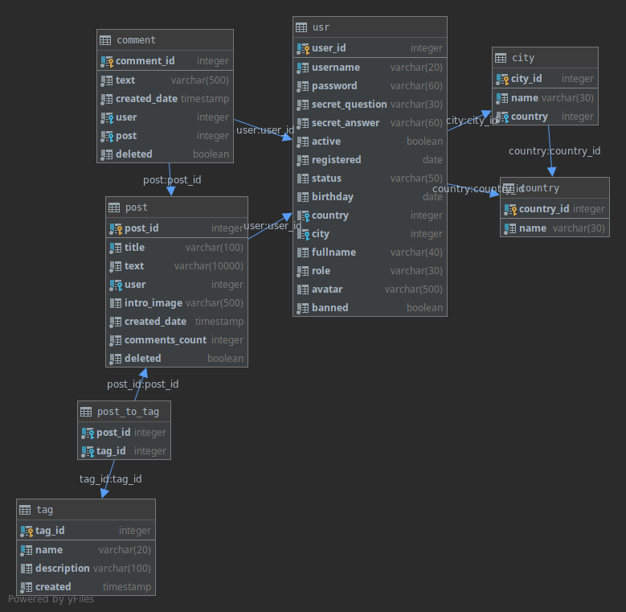

# Vaadin 13 + Spring Framework + PostgreSQL

In general it's a web-platform for blog-making and something like social network (like Habr or smth like that).

Made as a course project in 2019, 5 semester.

   
Screens

    
  

 
## PostgeSQL diagrams

Dump of base data in [blogcamp.tar](blogcamp.tar) archive.
