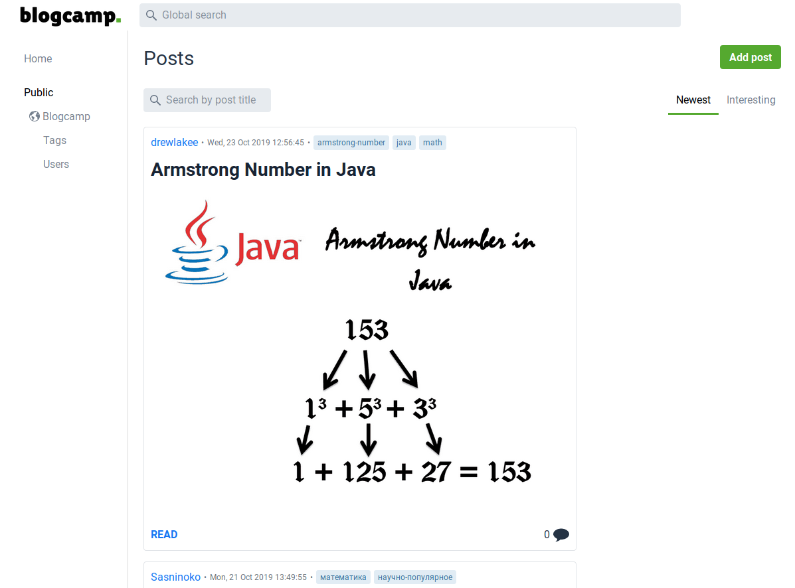
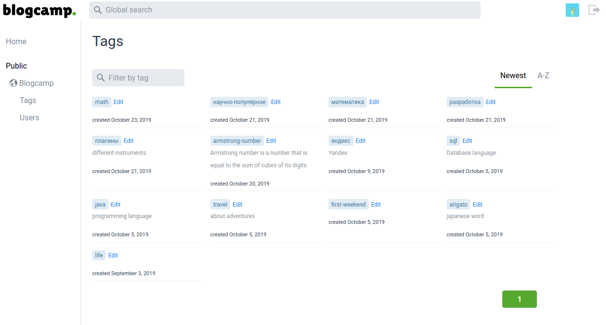
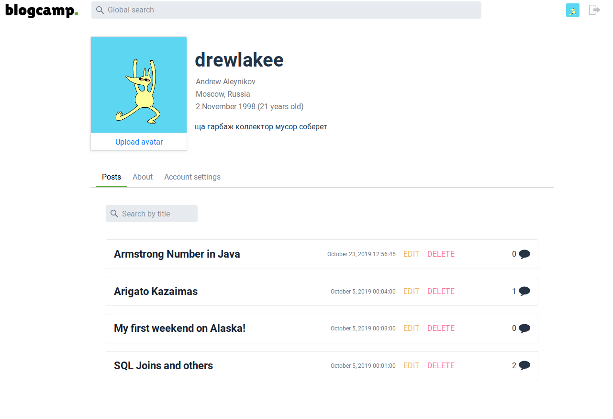

# Vaadin 13 + Spring Framework + PostgreSQL

Web-application on Vaadin for blog-managing.

Made as a course project in 2019, 5 semester.

   
Screens

    
  
  
  
  
  
  
  
  
  

   
SQL diagrams

    
  

Dump of database in [blogcamp.tar](blogcamp.tar) archive.
